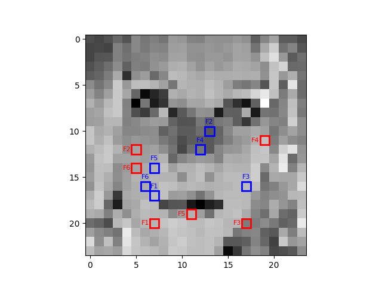

# Smile Classifier
This project implements a step-wise ensemble classifier to detect smiles in 24×24 grayscale images. The classifier makes predictions using binary pixel comparisons and selects the most informative features using a greedy step-wise approach.

## Features
* **Step-wise Feature Selection**: Iteratively selects the best pixel comparison features to maximize accuracy.
* **Ensemble Classification**: Uses an ensemble of 6 weak classifiers to improve performance.
* **Vectorized Implementation**: Optimized for efficient computation without loops.
* Training & Testing Analysis: Evaluates accuracy as a function of training set size.

## Dependencies
Make sure you have the following Python libraries installed:  
```bash
pip install numpy matplotlib
```

## Run Instructions
Run the main script to train and evaluate the model:  
```bash
python smile.py
```

## Visualizing the Learned Features


## Training and Testing Accuracy
| N    | Training Accuracy | Testing Accuracy |
|------|------------------|------------------|
| 200  | 0.89000         | 0.67670         |
| 400  | 0.84250         | 0.71116         |
| 600  | 0.83000         | 0.75000         |
| 800  | 0.80750         | 0.70624         |
| 1000 | 0.82000         | 0.74508         |
| 1200 | 0.80417         | 0.75602         |
| 1400 | 0.80214         | 0.75766         |
| 1600 | 0.79625         | 0.76805         |
| 1800 | 0.79000         | 0.76094         |
| 2000 | 0.78400         | 0.76477         |
